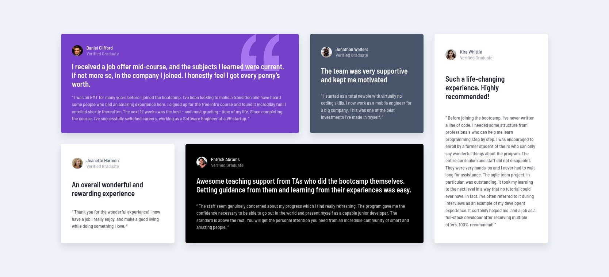

# Frontend Mentor - Testimonials grid section solution

This is a solution to the [Testimonials grid section challenge on Frontend Mentor](https://www.frontendmentor.io/challenges/testimonials-grid-section-Nnw6J7Un7). Frontend Mentor challenges help you improve your coding skills by building realistic projects.

## Table of contents

- [Overview](#overview)
  - [The challenge](#the-challenge)
  - [Screenshot](#screenshot)
  - [Links](#links)
- [My process](#my-process)
  - [Built with](#built-with)
  - [What I learned](#what-i-learned)
  - [Continued development](#continued-development)
- [Author](#author)

## Overview

### The challenge

Users should be able to:

- View the optimal layout for the site depending on their device's screen size

### Screenshot

### Links

- Solution URL: [My Solution](https://www.frontendmentor.io/solutions/responsive-testiomonials-grid-section-using-sass-grid-and-flexbox-rkCwSRFf9)
- Live Site URL: [Live Site](https://duncan91-ops.github.io/testimonials-grid-section/)

## My process

### Built with

- Semantic HTML5 markup
- CSS custom properties
- Flexbox
- CSS Grid
- Mobile-first workflow

### What I learned

- CSS GRID
- CSS FLEXBOX
- RESPONSIVE LAYOUTS & UNITS

### Continued development

- CSS GRID
- RESPONSIVE LAYOUTS & UNITS
- CSS FLEXBOX

## Author

- Frontend Mentor - [@duncan91-ops](https://www.frontendmentor.io/profile/duncan91-ops)
